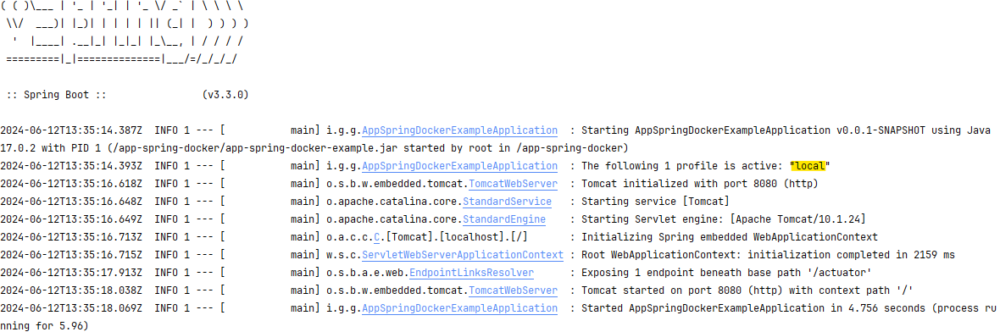

# Aplicação spring boot com exemplo de comandos docker

Build do projeto. -> **docker build -t springio/app-spring-docker-example .**   
Criando container. -> **docker run -e "SPRING_PROFILES_ACTIVE=local" --name nome-container -d -p 8080:8080 springio/app-spring-docker-example**  
Descubra o id do container com o seguinte comando. -> **docker ps**  
Mostrar logs no console.  -> **docker container logs -f container_id**

### A saída do console terá a informação mostrando o profile que subiu na aplicação.

